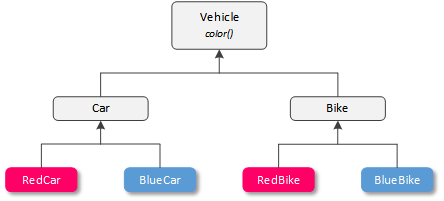

# Introduction to Bridge pattern

Hello folks and welcome to another article related to design patterns. In this one I would like to take a look at another structural pattern called - the bridge pattern.

Let's first start with a formal explanation of the pattern. The bridge pattern is meant to be used as a tool to decouple an abstraction from its implementation in order for them to vary independently. The bridge pattern uses and prefers composition over inheritance in order to achieve the above. I've got a [separate piece](https://python.plainenglish.io/python-classes-inheritance-vs-composition-e64aa70b4c39) on composition and inheritance. To give you a short preview:

* Inheritance in simple terms is a way of inheriting attributes and methods from a parent into a child class. Classes have "is a" relationship.
* Composition is a concept in object-oriented programming, that describes the reference between instance attributes of one class to another class, which means that rather than having inheriting from a base class, a class is being created (composed) from two or more other classes. Classes have "has a" relationship.

As always, a picture is worth a thousand words, so lets take a closer look.

## Example without bridge pattern
If we were to build a software system that uses purely inheritance aka no bridge pattern we would get something similar to the diagram below.



The diagram represents the relationship between a base class called Vehicle and its child classes that inherit from it. Each child class must implement at least a `color()` method and additional methods (if needed) to better describe the class being created (car can have an engine, while the bike does not). As seen from above, there are lot of elements that are being duplicated and quite a lot of classes to implement something basic. On top of that, if we were to add more classes (another type of vehicle), we would need to create another class and subclass it.

## Example with bridge pattern
The bridge pattern tries to solve the issue by creating separate classes or hierarcies so that, the original class (Vehicle in our case) will later composed of those new classes (Color() in our case). The hierarchical structure of the bridge pattern is presented below.


By following this approach, the diagram above visually describes the relationship between our new classes. As seen, we've got now two separate classes where Vehicle() will implement a Color() for each of its instances. The big difference comes when we try to extend the classes, e.g. by another color - say green. We will only have to create one subclass of Color(), instead of two if we weren't using the bridge pattern. 

# Python implementation
Now that we have a better understanding of the bridge pattern, we can move on to an actual implementation of the examples above.

First, we need to define our abstract class.

```
from abc import ABC, abstractmethod

class Color(ABC):
    
    @abstractmethod
    def paint(self):
        ...

class Vehicle(ABC):

    def __init__(self, color: Color):
        self.color = color
    
    @abstractmethod
    def apply_color(self):
        ...
```

Here, we've got the `Vehicle()` and `Color()` classes inheriting from ABC. The `Color()` class needs to implement a single paint method, while the Vehicle class accepts a single parameter during instance creation (`Color()`) and needs to implement an apply method for that particular color. If you've noticed, the `init` method of `Vehicle()` uses type anotation to explicitly denote that a instance of `Color()` class has to be supplied to it.

Now that we have abstract classes, we can move to implementation. For the `Color()` class we could define the following.

```
from classes import Color, Vehicle

class Red(Color):

    def paint(self):
        print(f'Painting using {__class__.__name__} color')

class Blue(Color):

    def paint(self):
        print(f'Painting using {__class__.__name__} color')
```

Each color subclass implements the `paint()` method as defined in the abstract class and prints to the console the color that the vehicle will be painted with. We are using `__class__.__name__` to dynamically retrieve the class color.

On the other hand, vehicle subclasses implements `apply_color()` to apply the color passed during instance creation.

```
class Car(Vehicle):

    def apply_color(self):
        self.color.paint()

class Bike(Vehicle):

    def apply_color(self):
        self.color.paint()
```

Notice that here we don't need to create another `__init__()` method since this has been taken care of by the parent class. If we, for some reason, try to create an instance of `Car()` or `Bike()` without supplying a color object, we would get the following error.

```
>>> vw = Car()
>>> vw.apply_color()

TypeError: Vehicle.__init__() missing 1 required positional argument: 'color'
```

To avoid this error, we firstly need to create the color instance and pass it to `Car()` or `Bike()`.
```
>>> color = Blue()
>>> vw = Car(color)
>>> vw.apply_color()

Painting using Blue color
```

Now that we have such structure, we can simply add new vehicles or colors with minimal to no modification of the existing code base. This approach follows one of SOLID's principles (Open-Closed Principle) which states that `classes should be open for extension and closed to modification.` For example, define new color (`Green()`) is simple as adding a new sublcass.

```
class Green(Color):

    def paint(self):
        print(f'Painting using {__class__.__name__} color')
```

The great part of that is when we ship the code to our clients, they don't have to do anything special to take advantage of the newly added functionality (new color) and can directly start to apply it without any breaking changes.